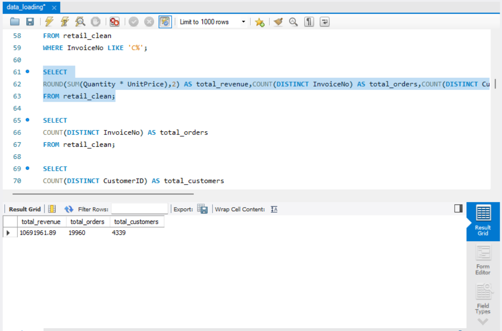
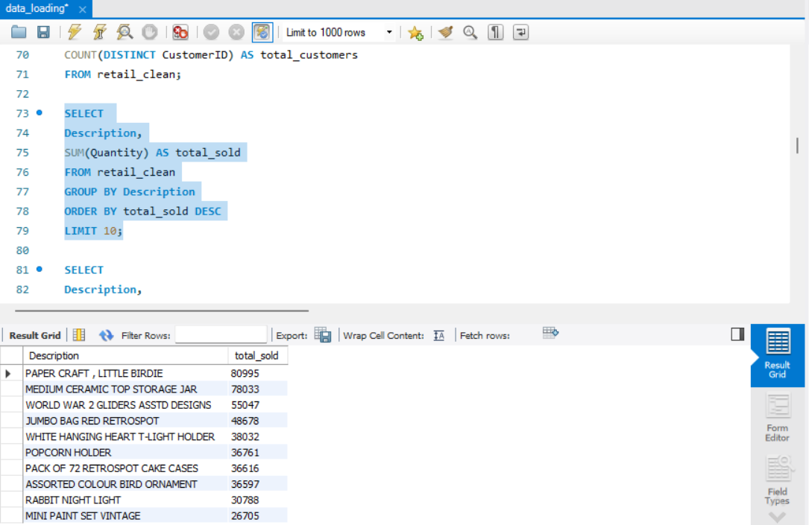
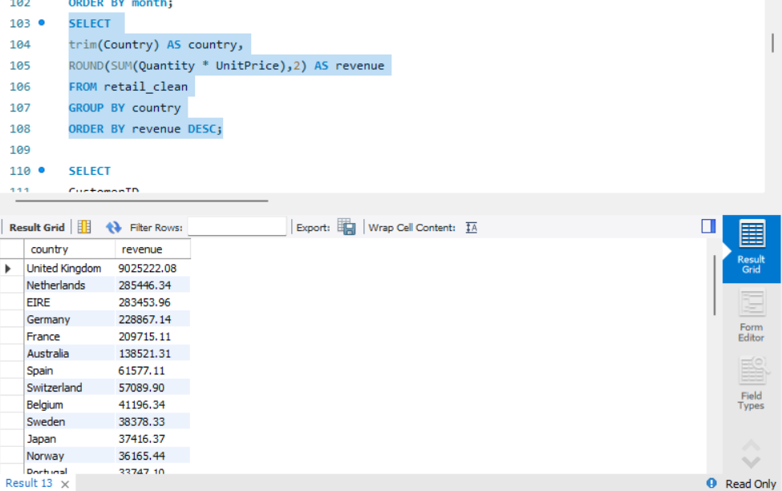
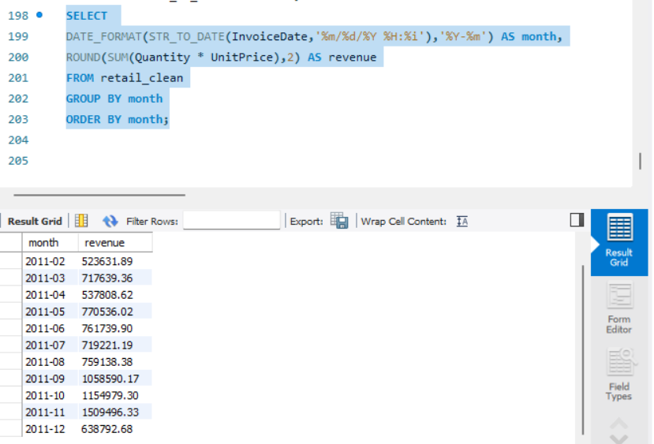
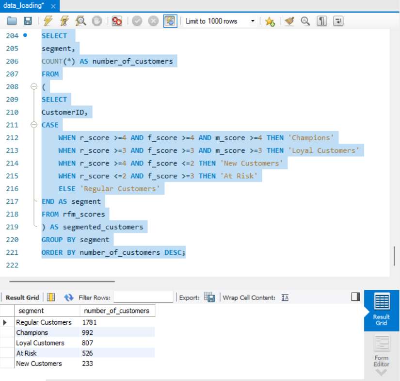

# SQL E-Commerce Sales Analysis

## Project Overview
This project analyzes an e-commerce retail dataset using SQL to extract business insights.  
The analysis focuses on sales performance, product demand, geographic distribution of revenue, and customer segmentation.

The project demonstrates SQL skills including:

- Data loading
- Data cleaning
- KPI calculation
- Aggregations
- Time-series analysis
- Customer segmentation using RFM analysis

---

## Dataset

The dataset contains transactional data from a UK-based online retail store between **2010 and 2011**.

Dataset Source:  
[Online Retail Dataset – Kaggle](https://www.kaggle.com/datasets/lakshmi25npathi/online-retail-dataset)

---

## Tools Used

- MySQL
- SQL

---

# Key Business Metrics

Key KPIs extracted from the dataset:

- **Total Revenue:** €10.69M
- **Total Orders:** 19,960
- **Total Customers:** 4,339
- **Average Order Value:** ~€535

---

# Top Selling Products

Analysis shows the most frequently purchased products in the dataset.

---

# Revenue by Country

Most revenue comes from the **United Kingdom**, which accounts for the majority of transactions.

---

# Monthly Revenue Trend

Sales peak toward the end of the year, particularly in **November**, indicating strong seasonal demand.

---

# Customer Segmentation (RFM Analysis)

Customers were segmented using the **RFM model**:

- Champions
- Loyal Customers
- Regular Customers
- At Risk
- New Customers

This helps identify high-value customers and those who may need retention strategies.

---

# SQL Project Structure
sql\\
1_data_loading.sql\\
2_data_cleaning.sql\\
3_kpi_analysis.sql\\
4_product_analysis.sql\\
5_country_analysis.sql\\
6_time_series_analysis.sql\\
 7_rfm_analysis.sql

---

# Key Insights

- The **UK generates the majority of total revenue**.
- Several products dominate sales volume.
- Sales show **clear seasonal patterns**, peaking in November.
- RFM segmentation reveals a large group of loyal and repeat customers.

---

# Author

**Anastasios Saliaris**

SQL Data Analysis Project
 
